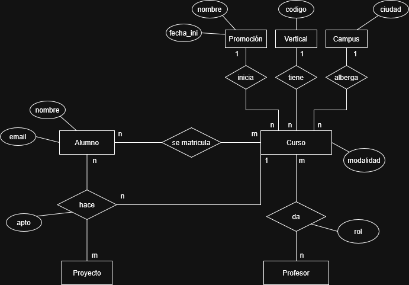
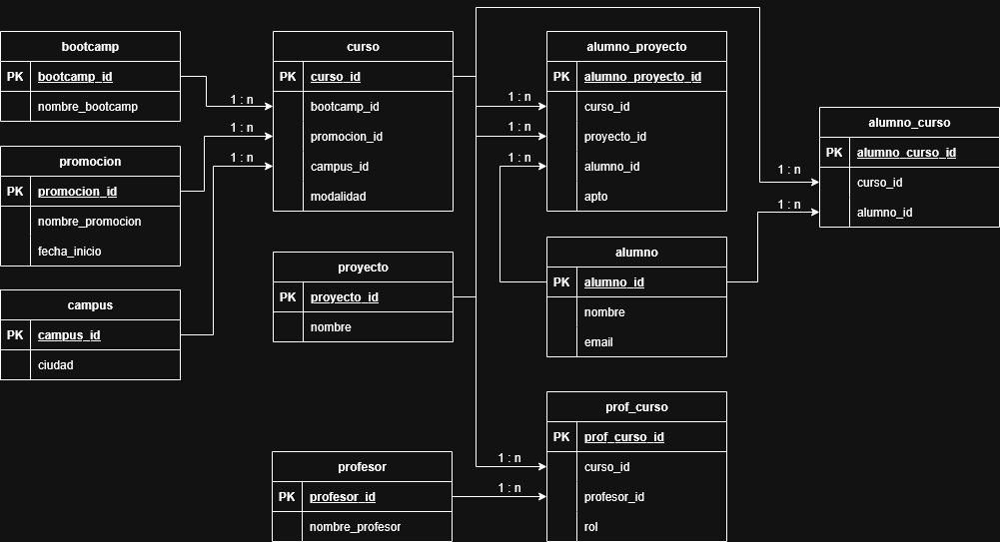

# Base de Datos Bootcamp

Diseño e implementación de una base de datos relacional para la gestión de datos de un bootcamp, a partir de cinco archivos CSV con datos de alumnos, profesores y cursos. 

El proyecto abarca el diseño del esquema entidad-relación, la creación de las tablas, la carga de los datos originales y el despliegue de la base de datos en un servidor.

---

## 🗄️ Datos de Origen

| Archivo | Descripción |
|---|---|
| `clase_1.csv` | Datos de alumnos y proyectos de la clase 1 |
| `clase_2.csv` | Datos de alumnos y proyectos de la clase 2 |
| `clase_3.csv` | Datos de alumnos y proyectos de la clase 3 |
| `clase_4.csv` | Datos de alumnos y proyectos de la clase 4 |
| `claustro.csv` | Listado de los profesores |

---

## 🧩 Diagrama Entidad-Relación

  

### 🧱 Diseño de Tablas

  

## 🏗️ Creación de tablas

Las tablas han sido creadas mediante las funciones definidas en `db_scripts/table_generation.py`. El proceso se divide en dos fases: primero las tablas base (`alumno`, `campus`, `proyecto`, `bootcamp`, `profesor`, `promocion`) y después las tablas dependientes (`curso`, `prof_curso`, `alumno_proyecto`, `alumno_curso`), respetando el orden de dependencia entre ellas.

## 📥 Inserción de datos

Los datos han sido extraídos de los archivos CSV (`clase_1` a `clase_4` y `claustro`) y cargados en la base de datos mediante las funciones definidas en `db_scripts/etl.py`. El proceso sigue el orden de dependencias entre tablas: primero las tablas base (`bootcamp`, `campus`, `promocion`, `alumno`, `proyecto`, `profesor`) y después las tablas que dependen de ellas (`curso`, `prof_curso`, `alumno_curso`, `alumno_proyecto`).

**Limitación conocida de los datos:** La tabla `curso` incluye `modalidad` (Presencial/Online) como parte de su definición, lo que significa que una misma combinación de bootcamp/promocion/campus puede tener dos entradas distintas en `curso` según el modo de impartición. Sin embargo, los archivos CSV de alumnos (`clase_1` a `clase_4`) no incluyen el campo `modalidad`, por lo que no es posible determinar en qué versión del curso participó cada alumno. Como consecuencia, los alumnos han sido asignados a entradas de `curso` sin tener en cuenta la modalidad. Esta es una limitación conocida del conjunto de datos actual y requeriría recopilar información adicional para resolverse correctamente (o un diseño del esquema de tablas diferente).

## ☁️ Alojamiento de la BD
La base de datos ha sido desplegada utilizando [Render](https://render.com), lo que permite su acceso remoto, escalabilidad y fácil integración con el resto del proyecto.

## 🔍 Queries de prueba
